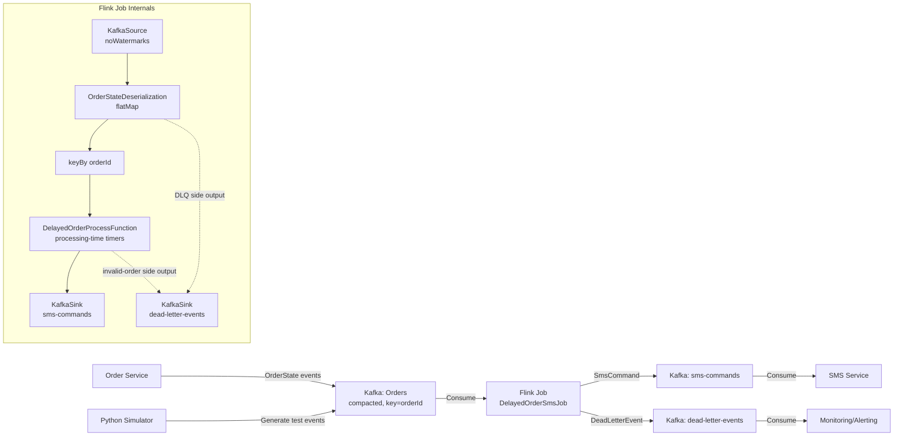

# RFC: Delayed Order Detection & SMS Notification System

**Status:** Draft
**Author:** Delayed Order SMS Team
**Date:** 2025-02-01
**Version:** 1.0

---

## 1. Overview

This RFC describes the architecture and design of the Delayed Order SMS Detection system, an Apache Flink streaming job that monitors order lifecycle events and emits SMS notification commands when orders exceed their expected delivery time.

### 1.1 Purpose

E-commerce orders have an `expectedDeliveryTime` promise to customers. When this time passes without the order being delivered, the customer should be notified via SMS that their order is delayed. This system detects such conditions in real-time and generates commands for the downstream SMS service.

### 1.2 Scope

- **In scope:** Real-time detection of delayed orders, idempotent SMS command emission, dead letter queue for invalid events, state management with TTL.
- **Out of scope:** Actual SMS delivery, order lifecycle management, customer preference management, analytics/reporting.

---

## 2. Architecture

### 2.1 Architecture Diagram (Mermaid)



### 2.2 Architecture Diagram (ASCII)

```
┌──────────────┐     ┌─────────────────┐     ┌──────────────────────────┐
│              │     │                 │     │                          │
│ Order        │────▶│ Kafka: Orders   │────▶│ Flink: DelayedOrderSms   │
│ Service      │     │ (compacted)     │     │ Job                      │
│              │     │                 │     │                          │
└──────────────┘     └─────────────────┘     └──────────┬───────────────┘
                                                        │
                          ┌─────────────────────────────┼─────────────────────────────┐
                          │                             │                             │
                          ▼                             ▼                             ▼
                  ┌───────────────┐           ┌─────────────────┐          ┌──────────────────┐
                  │ Kafka:        │           │ Kafka:          │          │ Flink UI         │
                  │ sms-commands  │           │ dead-letter-    │          │ Metrics          │
                  │               │           │ events          │          │ (counters)       │
                  └───────┬───────┘           └────────┬────────┘          └──────────────────┘
                          │                            │
                          ▼                            ▼
                  ┌───────────────┐           ┌─────────────────┐
                  │ SMS Service   │           │ Monitoring /    │
                  │ (dedup by     │           │ Alerting        │
                  │  commandId)   │           │                 │
                  └───────────────┘           └─────────────────┘
```

---

## 3. Data Flow

### 3.1 Input Flow

1. Order Service publishes `OrderState` JSON events to the compacted Kafka topic `Orders`, keyed by `orderId`.
2. Flink's `KafkaSource` reads from `Orders` using `OffsetsInitializer.latest()` and `WatermarkStrategy.noWatermarks()`.
3. `OrderStateDeserializationFunction` (a `FlatMapFunction`) parses JSON strings into `OrderState` POJOs.
4. Malformed JSON → `DeadLetterEvent` emitted to side output → `dead-letter-events` topic.

### 3.2 Processing Flow

1. Events are keyed by `orderId` and processed by `DelayedOrderProcessFunction`.
2. For each event:
   - Validation: null `orderId`, missing required fields → `DeadLetterEvent` to side output.
   - Staleness check: if `lastUpdatedAt` ≤ state's `lastUpdatedAt`, skip (stale update).
   - State update: write latest `OrderDelayState` to RocksDB-backed keyed state.
3. Timer logic:
   - **Non-terminal status (ACCEPTED, PICKED_UP, CREATED) + future ETA:** Register processing-time timer for `expectedDeliveryTime.toEpochMilli()`.
   - **ETA already passed:** Emit `SmsCommand` immediately.
   - **Terminal status (DELIVERED, CANCELLED):** Delete any existing timer, clear state (or let TTL expire).

### 3.3 Output Flow

1. `SmsCommand` POJO serialized to JSON via `SmsCommandSerializationSchema` → Kafka topic `sms-commands`.
2. `DeadLetterEvent` POJO serialized to JSON via `DeadLetterEventSerializationSchema` → Kafka topic `dead-letter-events`.

---

## 4. Topic Contracts

### 4.1 Input: `Orders` Topic

| Property | Value |
|----------|-------|
| Topic name | `Orders` (configurable via `--orders-topic`) |
| Key | `orderId` (String) |
| Value | JSON `OrderState` |
| Cleanup policy | `compact` |
| Partitioning | By `orderId` hash |

### 4.2 Output: `sms-commands` Topic

| Property | Value |
|----------|-------|
| Topic name | `sms-commands` (configurable via `--sms-commands-topic`) |
| Key | `commandId` = `"{orderId}:DELAY_SMS"` |
| Value | JSON `SendDelaySmsCommand` |
| Cleanup policy | `delete` (retention-based) |
| Delivery guarantee | At-least-once (idempotent via `commandId`) |

### 4.3 Output: `dead-letter-events` Topic

| Property | Value |
|----------|-------|
| Topic name | `dead-letter-events` |
| Key | `null` (round-robin) |
| Value | JSON `DeadLetterEvent` |
| Cleanup policy | `delete` (retention-based) |

---

## 5. State Model

### 5.1 `OrderDelayState` (Keyed State)

```java
public class OrderDelayState {
    String orderId;
    String customerId;
    String storeId;
    OrderStatus status;           // Current lifecycle status
    Instant expectedDeliveryTime; // ETA for delivery
    Instant lastUpdatedAt;        // For stale-update detection
    boolean delaySmsEmitted;      // Idempotency guard
    Long registeredTimerTime;     // Currently registered timer (ms), null if none
}
```

### 5.2 State Lifecycle

```
CREATE → (timer registered) → TIMER FIRES → SMS_EMITTED → (TTL expires) → DELETED
  │                              │
  └── DELIVERED/CANCELLED ──────▶ (timer deleted, TTL expires) → DELETED
```

### 5.3 State Backend

- **Backend:** EmbeddedRocksDBStateBackend (incremental checkpoints enabled)
- **Checkpoint storage:** `file:///opt/flink/data/checkpoints` (configurable)
- **Checkpoint interval:** 30s (configurable via `--checkpoint-interval-ms`)

---

## 6. Timer Semantics

### 6.1 Timer Type

**Processing-time timers** — fire based on the system clock of the TaskManager. See ADR-0001 for rationale.

### 6.2 Timer Lifecycle

| Event | Timer Action |
|-------|-------------|
| Non-terminal order with future ETA | Register timer at `expectedDeliveryTime.toEpochMilli()` |
| ETA updated (changed) | Delete old timer, register new timer |
| Order delivered/cancelled | Delete timer |
| Timer fires, order still active | Emit SMS, set `delaySmsEmitted = true` |
| Timer fires, order terminal | No-op (terminal check prevents emission) |

### 6.3 Timer Consistency

Timers are stored in RocksDB as part of Flink's managed keyed state. On checkpoint/restore, timers are restored along with user state.

---

## 7. Scalability

### 7.1 Parallelism

- Default parallelism: 2 (configurable via `--parallelism`)
- Source parallelism: Inherited from env default
- Keyed stream: Partitioned by `orderId` hash → same key always goes to same subtask
- Scaling up: Increase parallelism → state is redistributed across more subtasks via Flink's rescaling

### 7.2 Throughput Considerations

- **Kafka source:** Bounded by Kafka partition count and consumer throughput.
- **Process function:** CPU-bound (JSON parsing + state access). Each `orderId` is processed sequentially within its key group.
- **State size:** ~1KB per active order. With 1M active orders → ~1GB state. RocksDB handles this efficiently with SSD-backed storage.
- **Hot keys:** Not expected — orders are evenly distributed by `orderId`.

---

## 8. Failure Modes

### 8.1 Failure Modes and Mitigations

| Failure Mode | Impact | Detection | Mitigation |
|-------------|--------|-----------|------------|
| Kafka broker down | Source stalls, no events consumed | `KafkaSource` logs errors; Flink job fails after restart attempts | Kafka cluster redundancy; Flink restarts from last checkpoint |
| Malformed JSON in Orders topic | Parse failure | `parse_errors` metric increments; `DeadLetterEvent` emitted | DLQ allows inspection; schema validation at producer |
| Order with null `orderId` | Validation failure | `invalid_messages` metric increments; `DeadLetterEvent` emitted | Fix upstream producer |
| Timer not firing | SMS not sent, SLA breach | `delayed_orders_detected` metric drops to zero; alert on anomaly | Investigate timer service; check for `stale_updates_ignored` spike |
| Duplicate SMS | Customer receives multiple texts | Customer complaints | `commandId` idempotency; `delaySmsEmitted` boolean |
| RocksDB corruption | State loss | Checkpoint failures; job restart | Restore from last healthy checkpoint; incremental checkpoints minimize loss window |
| State growth (no TTL) | Memory/disk exhaustion | Monitor RocksDB state size metric | TTL configured (7 days default); alert on state size growth |

---

## 9. Monitoring Requirements

### 9.1 Flink Metrics (Custom)

| Metric | Type | Description | Alert Threshold |
|--------|------|-------------|-----------------|
| `delayed_orders_detected` | Counter | Orders where ETA passed while active | Drop to 0 for > 10 min → CRITICAL |
| `sms_commands_emitted` | Counter | SMS commands written to Kafka | Drop to 0 while `delayed_orders_detected` > 0 → WARNING |
| `stale_updates_ignored` | Counter | Events skipped due to staleness | Spike > 100/min → WARNING |
| `invalid_messages` | Counter | Events failing validation | Any increment → WARNING (review DLQ) |
| `parse_errors` | Counter | JSON parse failures | Spike > 10/min → CRITICAL |

### 9.2 Flink System Metrics

| Metric | Description |
|--------|-------------|
| `numRecordsInPerSecond` | Input throughput |
| `numRecordsOutPerSecond` | Output throughput |
| `checkpointDuration` | Checkpoint latency |
| `checkpointSize` | State size per checkpoint |
| `currentInputWatermark` | Should be `Long.MAX_VALUE` (no watermarks) |

### 9.3 Kafka Metrics

| Metric | Description |
|--------|-------------|
| Consumer lag on `Orders` topic | Source topic lag |
| Producer record send rate to `sms-commands` | Output throughput |
| Producer record send rate to `dead-letter-events` | DLQ throughput |

---

## 10. Configuration Reference

| Parameter | Default | Description |
|-----------|---------|-------------|
| `--kafka-bootstrap-servers` | `kafka:9092` | Kafka bootstrap servers |
| `--orders-topic` | `Orders` | Source topic |
| `--sms-commands-topic` | `sms-commands` | SMS command sink topic |
| `--consumer-group-id` | `delayed-order-sms-job` | Consumer group ID |
| `--parallelism` | `2` | Job parallelism |
| `--checkpoint-interval-ms` | `30000` | Checkpoint interval in ms |
| `--checkpoint-storage-path` | `file:///opt/flink/data/checkpoints` | Checkpoint storage path |
| `--restart-attempts` | `10` | Max restart attempts |
| `--restart-delay-ms` | `10000` | Delay between restart attempts |
| `--state-ttl-days` | `7` | State TTL in days |

---

## 11. References

- ADR-0001: Processing Time vs Event Time
- ADR-0002: SMS Idempotency Strategy
- `schemas/order-events/order-state.schema.json`
- `schemas/sms-commands/send-delay-sms-command.schema.json`
- `docs/runbooks/local-runbook.md`
- `docs/runbooks/production-runbook.md`